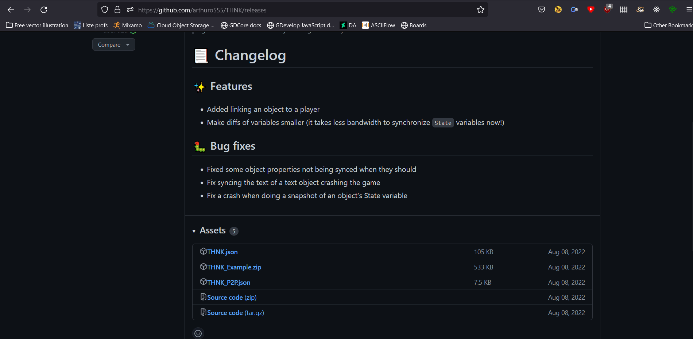
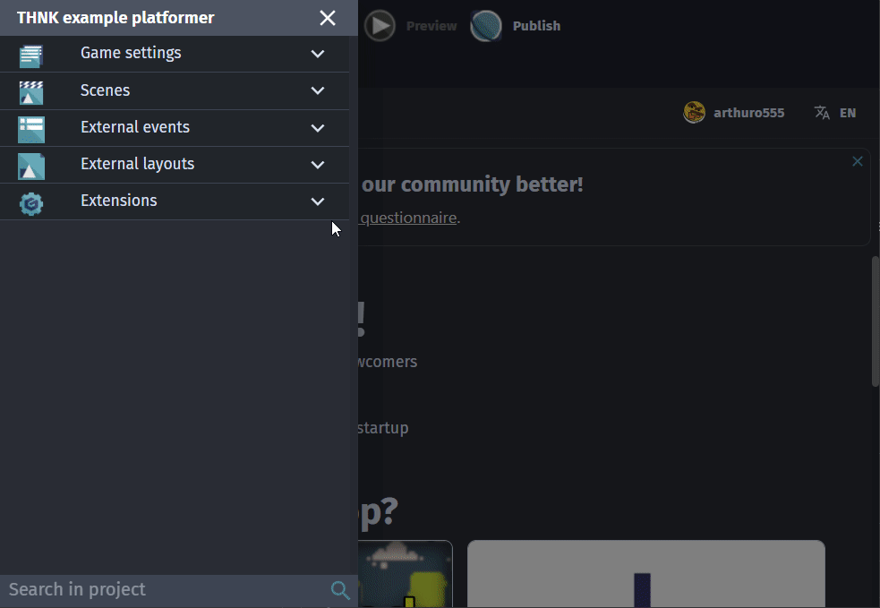

# Installing THNK

:::caution

THNK is currently in early stages. It is still usable and a much better experience than building multiplayer by yourself, but it may have bugs or features that are important for you that are not yet available. Be aware of this when considering THNK!

:::

## Pre-requisites

THNK is a GDevelop framework, so you will need to have GDevelop downloaded. It is recommended to have some base GDevelop knowledge before getting started with THNK. [You can find resources to learn GDevelop on the GDevelop wiki.](https://wiki.gdevelop.io/gdevelop5/tutorials/basic-game-making-concepts)

## Installation

To get started with THNK, the first step is to download the core THNK extension. Currently, it is not available yet in the extention gallery, and has to be installed manually.

To do so, download the [latest release of THNK from github](https://github.com/arthuro555/THNK/releases) (or you can [get the latest nightly build](https://raw.githubusercontent.com/arthuro555/THNK/master/extensions/THNK.json)).

To import it, go into the Project Manager, click on Functions/Behaviors, select "Create or search for new extensions", and finally click "Import extension" button at the bottom left. It will open a file selector that will allow you to open the THNK extension file.

## Install an adapter

THNK by itself doesn't provide much value, make sure you follow the same steps
