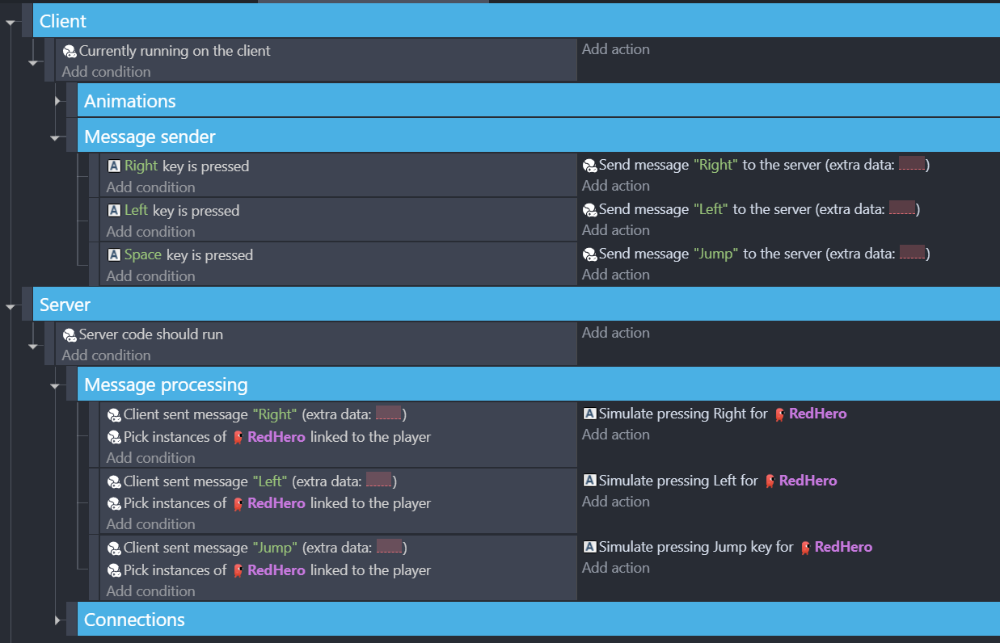

# Using THNK for a platformer

## Create a basic platformer

Let's make a platformer! First, we'll add a platformer character (with the default controls on) and a few platforms using GDevelop's default behaviors.

<video
  title="well you probably already know how that works lol"
  width="100%"
  muted
  loop
  controls
>
  <source src="/webm/platformer/behaviors.webm" type="video/webm" />
  

    A video of a GDevelop scene with objects that have the platformer character
    and platform behaviors attached
  

</video>

If you start a preview, you should be able to jump around on your platforms. Nothing too exciting yet, but now let's get right into what changes with THNK...

## Adding animations to the player

Let's add animations to the player! This is a fairly basic task in GDevelop. But remember, in THNK, events must be in one of two categories: Server or Client. Before adding animations, we need to decide in which section it belongs.

When you add events to your game, you must always ask yourself a few questions:

- Does it require information that the client should not know?
- Is it something that affects other players?

Here, player animations:

- Uses the position of players visible on-screen (to determine if they are moving or not), information that the client has anyway
- Only affects how the local game looks like, not the games of other players

Therefore, it should be in the client section!

<video
  title="IS THIS A MFing HARRY POTTER REFFERENCE?!?"
  width="100%"
  muted
  loop
  controls
>
  <source src="/webm/platformer/animations.webm" type="video/webm" />
  

    A video of a Harry Potter's sorting hat declaring those events should be put
    in client events.
  

</video>

:::note Why can't I just put it in server events?

Technically, you do not _need_ to have animations as client events, but it is in practice often a better idea. If it was on the server, it would be something to be synchronized with the clients. This is problematic for two reasons:

1. This is bad for bandwidth - each time an animation would change, the change would have to be sent to the clients. With a lot of objects and clients, this can quickly overload the network over transmitting something that the client in a way already knows, as it can infer it from the movement of other objects already. You should always try to reduce the communication between client and server to the minimum to avoid issues on lower speed connections.

2. This might make animations not match what is displayed. Since the server would handle the animations, the animations would only be updated on server ticks, which may be set at a lower rate than the rendering frame rate. For a few frames, the animation might not match what you would expect until the server sends an update.

:::

## Adapting the platformer for multiplayer

### Giving each client a player object

Ok, now we have a platformer with animations. Let's make it multiplayer-ready! First, we'll need to ensure each player has their own player character. To do so, it's simple: create an object when a client connects, and delete it when it disconnects. Connections and disconnections are core THNK conditions. You'll also want to _link the object to the player_: That will allow knowing what instance belongs to which player. You'll need it to know which instance of the platformer character to delete when a player leaves.

:::info

If you have an initial instance of the player on the scene, you should remove it! If the server is also a client (i.a. it is also a player), then the connection event will trigger once at the beginning of the scene too for creating the player object of the host.

:::

Since this is creating objects everyone should be able to see, it should be on the server - it affects other players and affects the game state, not just the visual representation of the game.

<video title="ooo that's pretty easy" width="100%" muted loop controls>
  <source src="/webm/platformer/connections.webm" type="video/webm" />
  
A video of adding the events described above to the events sheet.

</video>

Since we want the clients to be able to see the player objects, we need that object to be synchronized across the server and clients. To do so, it's very simple - simply add the synchronize behavior (from THNK) to your player object!

<video title="well that was surprisingly fast" width="100%" muted loop controls>
  <source src="/webm/platformer/add-sync-behavior.webm" type="video/webm" />
  
A video of adding the synchronize behavior to an object.

</video>

### Adding player controls for the clients

While the game might work with the default controls when testing in single-player, it needs a few adjustments to work online. The reason it works in single-player is that there, the game is the server, and the server can do whatever it wants. But when connecting clients, the platformer behaviors on the client will not be able to move the objects, since _only the server is allowed to move objects,_ **or change the game state generally**. Therefore, instead of letting the platformer behavior handle everything, we need to get the inputs and _send them to the server_. The server will then simulate key presses on behalf of the client on the platformer character of the player object that belongs to that player.

Therefore, in THNK, all interactions with the game, from player movement to using an item in the inventory, needs to be done as a command from the client to the server. It is then the server's job to validate and process the command, updating the game state accordingly for everyone to see.

#### The naive way

Sending a command from the client and receiving it on the server can be done with the corresponding action and conditions:

<video
  title="Remember to add messages both server- and client-side 😉"
  width="100%"
  muted
  loop
  controls
>
  <source src="/webm/platformer/messages.webm" type="video/webm" />
  

    A video of adding a message sending and receiving event to the events sheet.
  

</video>

:::note

You might have noticed that the "Pick object linked to player" doesn't ask you which player's objects it should pick. That is because THNK has _player picking_. When using a THNK condition (on player connected, on player disconnected, on player message, etc.), the player that initiated this condition will be picked, and other THNK actions like "Pick objects linked to a player" will use this picked player.

If you wish to target a player manually, you can get the currently picked player's ID, and change the picked the player to that player ID later, for THNK actions to target this player.

:::

#### The smart way

We have those events so far:

They may technically work, but... they have a few issues.

Receiving events in a normal event is more readable, but it only allows to process one message per server tick, which can cause issues when more player join. To handle all messages received in a single server tick, use a while event instead:

<video title="While event underrated smh" width="100%" muted loop controls>
  <source src="/webm/platformer/while.webm" type="video/webm" />
  

    A video of transferring the conditions and action from a standard event into
    a while event.
  

</video>

The second issue is that we shouldn't be using messages like this. When sending messages, you should always keep a few things in mind:

1. The connection may be instable, causing messages to be sometimes delayed
2. The traffic between server and client should be as minimal as possible, as to not use more bandwidth than available

Those events are sending every frame where a key is pressed a ton of inputs to the serve, taking a lot of bandwidth! Additionally, what if the connection is instable? If the server receives only every second or third tick a message, then as far as the server know, it is as if the player keeps on pressing and unpressing the button, where in fact they are still holding it...

To fix that, let's take another approach: We'll only send one message when pressing and releasing the button. That way, we send way less messages, and if the connection is instable, the server will continue using the same inputs as the last one it received from the client.

import smartInput1 from "./img/platformer/smart-input-1.png";
import smartInput2 from "./img/platformer/smart-input-2.png";
import smartInput3 from "./img/platformer/smart-input-3.png";
import smartInput4 from "./img/platformer/smart-input-4.png";

  {/* prettier-ignore */}
  

    
    
    
    
  

This solution is more complex, but will provide a much better experience.

:::tip

Of course, only do this where it makes sense: here, we are using it for movement inputs, which are continuous types of inputs. But a button that is not expected for continued use, for example one to use a consumable item, should be processed once and not continuously in the case that the server has not heard from the client what their action for the current tick will be.

:::

## Adding multiplayer connection

The game should now be ready for being played in multiplayer! [Head over to the next page](/docs/getting-started/setup-networking) to find out how to get your players connected together in your scene.
