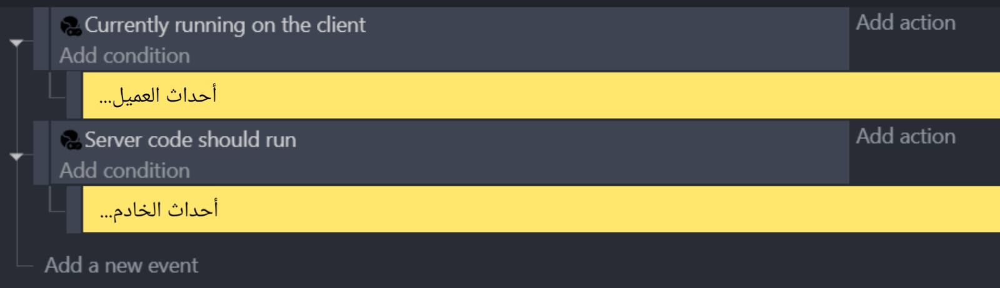
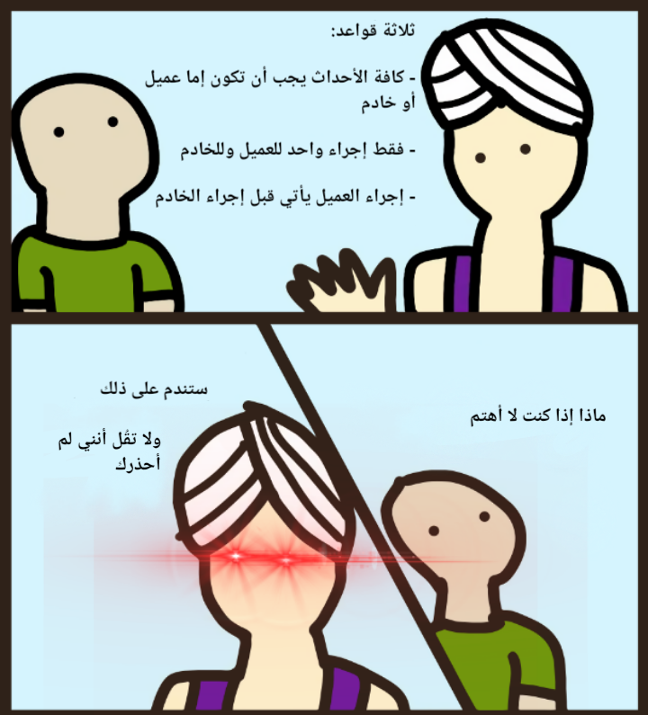

# إنشاء مشهد THNK

ليس لدى THNK الكثير من المتطلبات لإنشاء مشهد يعمل معه، كل ما عليك فعله هو فصل تعليمات العميل البرمجية عن تعليمات الخادم البرمجية.

:::tip تذكر!

**تعليمات العميل البرمجية** هي الجزء الذي يستخدمه اللاعبون للتفاعل مع اللعبة. أي عناصر محسوسة، مثل الكاميرا ومؤثرات الكائن أو الطبقات والرسوم المتحركة للكائن والموسيقى، أو التفاعلات مع اللعبة، مثل المدخلات والقوائم...

**تعليمات الخادم البرمجية** هي الجزء الذي يحدد منطق اللعبة والوضع الخاص بك، الذي يجب أن يكون المخترق غير قادر على العبث به. أشياء مثل مواقع الكائن أو الحركته وحالات الكائنات المختلفة والتصادمات وإحصائيات اللاعب وحسابات الأضرار القتالية...

:::

أبسط وأصلح مشهد THNK يبدو هكذا:

:::tip تذكر!

يجب أن يحترم كل مشهد من مشاهد THNK ثلاث قواعد:

1. يجب أن تكون التعليمات البرمجية تحت شرط العميل أو الخادم. لا بأس مع المجموعات والتعليقات، لكن مع الأحداث الفعلية فلا يجوز
2. يمكن أن يكون هناك تعليمة خادم برمجية واحدة فقط وكذلك مع تعليمة عميل البرمجية. استخدم الأحداث الفرعية بدلًا من تكرار الشرط.
3. يجب أن يكون تعليمة العميل البرمجية دائمًا قبل تعليمة الخادم البرمجية.

مع أن مخالفة هذه القواعد لن تعطل اللعبة فورًا، فإنه سيؤدي إلى حدوث سلوكيات غير متوقعة وثغرات سيكون من الصعب عليك تشخيصها وإصلاحها.

:::

يكفي محاضرة، لنبدأ في التطوير!
