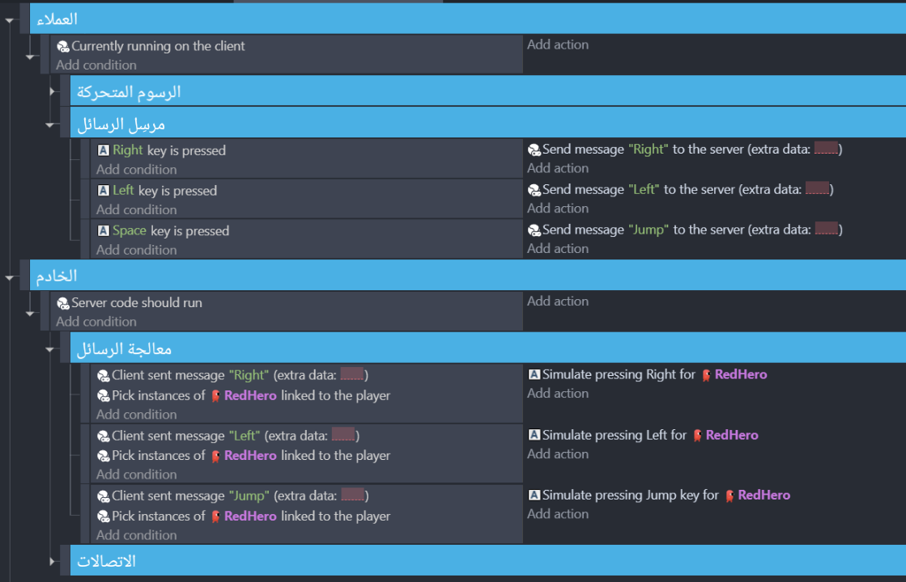

# استخدام THNK للعبة المنصات

## THNK ليس إطار عمل ألعاب متعددة اللاعبين.

إن THNK في صميمه هو إطار عمل مُؤَمَّن للألعاب. إنه _طريقة لبناء الألعاب_ التي تتبع بنية العميل والخادم الموثوقة. اللعبة التي تم بناؤها مع THNK جاهزة للتحول إلى لعبة جماعية بواسطة ملحق محول، ولكنها ليست لعبة جماعية بطبيعتها.

لذلك، ستنجح المعاينات بلا أي محول وستعمل اللعبة في اللعب الفردي بشكل جيد. عند البناء باستخدام THNK، ستبدأ ببناء اللعبة في اللعب الفردي، وتضيف اللعب الجماعي بعد ذلك بواسطة ملحقات المحولات.

لنبدأ البناء في اللعب الفردي!

## دعنا نصنع لعبة منصات!

أولًا، سنقوم بإضافة شخصية منصات (مع تشغيل التحكم الافتراضي) وبضعة منصات باستخدام السلوكيات الافتراضية لـ GDevelop. هذا أشبه بكيفية القيام بذلك في GDevelop - لا شيء جديد حتى الآن!

<video
  title="well you probably already know how that works lol"
  width="100%"
  muted
  loop
  controls
>
  <source src="/webm/platformer/behaviors.webm" type="video/webm" />
  

    فيديو لمشهد GDevelop مع كائنات تحتوي على شخصية منصات
    وسلوكيات المنصة المرتبطة
  

</video>

إذا بدأت معاينة، يجب أن تكون قادرًا على القفز حول المنصات الخاصة بك.

## إضافة رسوم متحركة إلى اللاعب

دعنا نضيف رسوم متحركة إلى اللاعب! وهذه مهمة أساسية إلى حد ما في GDevelop. لكن تذكر أن الأحداث في THNK يجب أن تكون في واحدة من الفئتين: الخادم أو العميل. وقبل إضافة الرسوم المتحركة، نحتاج إلى أن نقرر إلى أي فئة تنتمي إليها.

عند إضافتك أحداث إلى اللعبة، يجب أن تسأل نفسك دائمًا بعض الأسئلة:

-   هل يتطلب الأمر معلومات لا ينبغي للعميل أن يعرفها؟
-   هل هو شيء يؤثر على اللاعبين الآخرين؟

هنا، الرسوم المتحركة لللاعب:

-   يستخدم موقع اللاعبين المرئي على الشاشة (لتحديد ما إذا كانوا يتحركون أم لا)، المعلومات التي لدى العميل على أي حال
-   يؤثر فقط على كيف تبدو اللعبة المحلية، وليس ألعاب اللاعبين الآخرين

لذلك، ينبغي أن يكون في قسم العملاء!

<video
  title="?!?هل هذا ميم سخيف عن هاري بوتر؟!؟"
  width="100%"
  muted
  loop
  controls
>
  <source src="/webm/platformer/animations.webm" type="video/webm" />
  

    فيديو لقبعة الفرز الخاصة بهاري بوتر تصف له أن تلك الأحداث يجب أن توضع في أحداث العميل.
  

</video>

:::note لماذا لا يمكنني فقط وضعها في أحداث الخادم؟

من الناحية التقنية، أنت _لا تحتاج_ إلى أن يكون لديك رسوم متحركة كحدث عملاء، ولكن من الناحية العملية غالبًا ستكون فكرة أفضل. إذا كان على الخادم، فسيكون من الضروري مزامنته مع العملاء. وهذا أمر مثير للمشاكل لسببين:

1.  هذا سيء لعرض النطاق الترددي - في كل مرة تتغير فيها الرسوم المتحركة، يجب إرسال التغيير إلى العملاء. مع الكثير من الكائنات والعملاء، هذا يمكن أن يثقل بسرعة على الشبكة عبر إرسال شيء يعرفه العميل بطريقة مسبقة، حيث أنها يمكن أن تستنتج من حركة أشياء أخرى فعلًا. يجب أن تحاول دائمًا تقليل الاتصال بين العميل والخادم إلى الحد الأدنى لتجنب المشكلات على اتصالات أقل سرعة.

2.  قد يجعل هذا الرسوم المتحركة غير متطابقة مع ما يتم عرضه. حيث الخادم سيتعامل مع الرسوم المتحركة، سيتم تحديث الرسوم المتحركة فقط على دقات الخادم، الذي يمكن تعيينه بمعدل أقل من معدل الإطار المقدم. بالنسبة للإطارات القليلة، قد لا تتطابق الرسوم المتحركة مع ما ستتوقعه حتى يرسل الخادم تحديث.

:::

## تجهيز المنصة للعب الجماعي

### إعطاء لكل عميل لاعب

لدينا الآن لعبة منصات فردية بسيطة متحركة. دعنا نضيف بعض اللعب الجماعي فيها!
أولًا، سنحتاج إلى إخبار THNK بما يفعل عندما يتصل لاعب آخر. نريد أن يكون لكل لاعب شخصيته. لذلك، عند اتصال اللاعب، نحن بحاجة إلى إنشاء كائن لذلك اللاعب، وحذفه عندما ينقطع اتصاله. سنقوم _بربط الكائن باللاعب_: هذا سيتيح لنا معرفة أي مثيل ينتمي إلى أي لاعب. وبهذه الطريقة، سنعرف أي شخصية منصات سيتم حذفه عندما يغادر اللاعب.

:::tip اختيار اللاعب

ربما كنت قد لاحظت أنك لا تحدد اللاعب الذي تربط الكائن به. وذلك لأن THNK لديه امكانية اختيار اللاعب: حدث "On Connection" يختار اللاعب الذي يتصل لاستخدامه في الإجراءات التالية.

إذا كنت ترغب في ربط كائن (أو عمومًا استخدام أي إجراء THNK الذي يستخدمه اللاعب المختار) على لاعب آخر معين أو خارج حالة اختيار اللاعب، يمكنك استخدام إجراء "Pick player" لتحديد اللاعب للتأثر.

:::

:::info

إذا كان لديك مثيل أولي من اللاعب في المشهد، يجب إزالته! هذا المثيل سيكون صنم - بحيث أنه غير مرتبط بأي لاعب، ولن يستطيع أي أحد من التحكم به...

:::

ومن الواضح أن الاتصالات وانقطاع الاتصالات هي أحد شواغل الخادم، لذلك نحن بحاجة إلى التعامل معها ضمن أحداث الخادم.

<video title="ooo that's pretty easy" width="100%" muted loop controls>
  <source src="/webm/platformer/connections.webm" type="video/webm" />
  
فيديو لإضافة الأحداث المذكورة أعلاه إلى ورقة الأحداث.

</video>

بما أننا نريد أن يكون العملاء قادرين على رؤية كائنات اللاعبين، نحن بحاجة إلى أن يكون هذا الكائن متزامنًا من الخادم إلى جميع العملاء. للقيام بذلك، إنه بسيط جدًا - ببساطة أضف سلوك المزامنة (من THNK) إلى كائن اللاعب!

<video title="well that was surprisingly fast" width="100%" muted loop controls>
  <source src="/webm/platformer/add-sync-behavior.webm" type="video/webm" />
  
فيديو لإضافة سلوك المزامنة إلى كائن.

</video>

### إضافة تحكم اللاعبين للعملاء

في حين أن اللاعب قد يكون يتحكم في اللعب الفردي جيدًا -كما من المفترض أن يكون- لن يتم مزامنة الحركة مع العملاء الآخرين في اللعب الجماعي، على الرغم من سلوك المزامنة. _لماذا ذلك؟_

السبب هو أن السلوكيات تعمل على كل من العميل والخادم. لأن الخادم لا يستطيع قراءة إدخالات اللاعب، لأن هذه مهمة العميل. لن يتلقى سلوك لاعب المنصات أي إدخالات بقدر ما يتعلق الأمر بالخادم، وبذلك لن يرى العملاء الآخرون أي حركة.

لا يزال بإمكان العملاء تحريك شخصياتهم الخاصة كتعليمة عميل برمجية، التي لديها حق الوصول إلى إدخالات اللاعب، ويقوم أيضًا بتشغيل سلوك المنصة. يمكن فقط للخادم نقل الكائنات لجميع اللاعبين، وبذلك لن يتم تحديث هذه الحركة.

جميع اللاعبين يتفاعلون مع حالة اللعبة في THNK، من حركة اللاعب إلى استخدام عنصر في المخزون، تحتاج إلى أن تُرسَل كأمر من العميل إلى الخادم. ومن ثم فإن مهمة الخادم هي التحقق من صحة الأمر ومعالجته، وتحديث حالة اللعبة تبعًا لذلك لكي يراها الجميع.

في هذه الحالة، كل ما علينا فعله هو إرسال الإدخالات من العملاء وتغذيتهم بسلوك المنصة. سلوك المنصة سيعالج الطريقة التي ينبغي أن يتحرك بها الكائن وتحديث الموضع تلقائيًا، مع العناية بجزء "التحقق وتحديث حالة اللعبة" من معالجة الرسائل.

#### الطريقة الساذجة

إرسال أمر من العميل واستقباله على الخادم يمكن أن يتم مع الإجراءات والشروط المقابلة:

<video
  title="هذه هي الطريقة الساذجة، لا تجربوا هذا في المنزل يا أطفال!"
  width="100%"  muted
  loop
  controls
>
  <source src="/webm/platformer/messages.webm" type="video/webm" />
  

    فيديو لإضافة رسالة ترسل وتستقبل حدث إلى ومن صفحة الأحداث.
  

</video>

#### الطريقة الذكية

ولدينا حتى الآن تلك الأحداث:

قد تعمل من الناحية التقنية، ولكن... تشوهها عيوب.

Receiving events in a normal event is more readable, but it only allows to process one message per server tick, as the condition is only called once. ترك الرسائل تنطلق دون معالجة ويتم التعامل معها على الدقة التالية من المحتمل أن يسبب مشكلة إذا أرسل العديد من اللاعبين هذه الرسائل كثيرًا. للتعامل مع جميع الرسائل المستلمة في دقة خادم واحدة، استخدم حدث المدة الزمنية للتعامل مع الأحداث بينما بعضها متاح للمعالجة:

<video title="While event underrated smh" width="100%" muted loop controls>
  <source src="/webm/platformer/while.webm" type="video/webm" />
  

    فيديو لنقل الشروط والإجراءات من حدث عادي إلى
    حدث المدة الزمنية.
  

</video>

المشكلة الثانية هي نوع الرسالة التي نرسلها. عند إرسال الرسائل، يجب أن تضع في الاعتبار دائمًا بعض الأمور:

1.  قد يكون الاتصال غير مستقرًا، مما يؤدي إلى تأخير الرسائل في بعض الأحيان
2.  يجب أن تكون حركة المرور بين الخادم والعميل عند الحد الأدنى قدر الإمكان، حيث لا تستخدم عرض النطاق الترددي أكثر مما هو متاح

يجري إرسال تلك الأحداث في كل إطار يتم فيه الضغط على مفتاح ما. هذا كثير من الرسائل، وهذا يتطلب الكثير من عرض النطاق الترددي!
إذا لم يتم لسبب ما استلام رسالة من قبل الخادم قبل كل دقة، على سبيل المثال بسبب انقطاع اتصال قصير بسبب عدم استقرار الاتصال، ثم فيما يتعلق بالخادم، فسيبدو كما لو أن اللاعب يستمر في الضغط على الزر وإزالته، بينما لا يزال في الواقع ضاغطًا عليه.

لإصلاح ذلك، دعنا نأخذ بنهج آخر: سنرسل رسالة واحدة فقط عند الضغط ورسالة واحدة عند ترك الزر. بهذه الطريقة، يمكننا إرسال رسائل أقل، وإذا كان الاتصال غير مستقر أو أصبح غير مستقر، سيفترض الخادم أن العميل يواصل القيام بما كان يفعله بدلًا من افتراض أنه توقف عن القيام بأي شيء.

import smartInput1 from "./img/platformer/smart-input-1.png";
import smartInput2 from "./img/platformer/smart-input-2.png";
import smartInput3 from "./img/platformer/smart-input-3.png";
import smartInput4 from "./img/platformer/smart-input-4.png";

  {/* prettier-ignore */}
  

    
    
    
    
  

هذا الحل أكثر تعقيدًا، ولكنه سيوفر للاعبين تجربة أفضل بكثير.

:::caution

بالطبع نحن نفعل هذا فقط هنا لأنه من المنطقي أن تتطلب إدخالات اللاعب المستمرة هذا. فعلى سبيل المثال، ينبغي معالجة استخدام جرعة في ألعاب تبادل الأدوار لمرة واحدة فقط عند الطلب، وعلى الناحية الأخرى - استهلاك الجرعات باستمرار كل دقة خادم ما دام أن العميل لا يطلب التوقف ليس تصميم لعبة جيدة p:

:::
