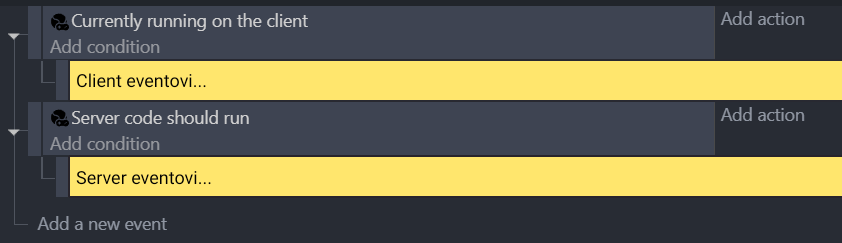
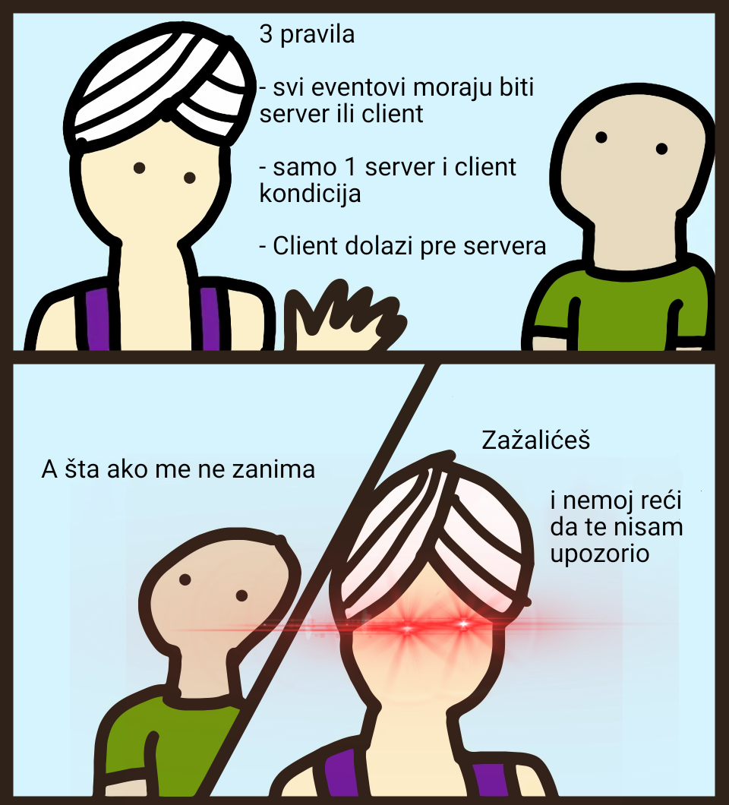

# Pravljenje THNK scene

THNK ne treba mnogo zahteva da bi napravili scenu sa kojom može da radi; Sve što treba da uradite je da razdvojite client kod od server koda.

:::tip Zapamtite!

**Clientov kod** je deo koji igrači koriste da imaju interakciju sa igrom. Any presentational elements, like the camera, object & layer effects, sprite animations, the music, or interactions with the game, like inputs, menus, HUDs...

**Server code** is the part that defines your game's logic and state, that a hacker should be unable to tamper with. Things like object positions & movement, states of different objects, collisions, player stats, combat damage calculations...

:::

The most basic, valid THNK scene looks like this:

:::tip Remember!

Every THNK scene must respect three rules:

1. Code needs to be under either a client or server condition. Group and comments are fine, but actual events cannot be
2. There can be only 1 server and 1 client code condition. Use sub-events instead of repeating the condition.
3. The client code must always go before the server code.

While it won't break your game immediately to disrespect those rules, they can lead to unexpected behavior and bugs that will be hard for you to diagnose and fix.

:::

Enough lecturing, let's get started creating!
